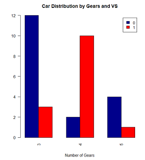
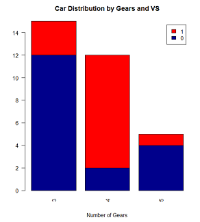
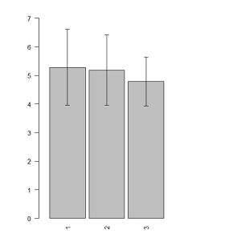
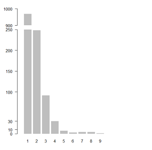

# barplot的各种不同形式
> 参考 Quick-R: http://www.statmethods.net/graphs/bar.html

## 简单情况

### 基本图形
```
counts <- table(mtcars$gear)
barplot(counts, main="Car Distribution", xlab="Number of Gears")
```

  

然而，图中bar太宽，需要调窄一点，这需要配合参数`xlim`

```
barplot(counts, main="Car Distribution", xlab="Number of Gears",
        xlim= c(0, 5)
        )
```


bar图水平放置，需要设置`horiz= TRUE`，另外配合使用参数`las`改变每个bar标签的方向

```
barplot(counts, main="Car Distribution", horiz=TRUE, las= 1,
        names.arg=c("3 Gears", "4 Gears", "5 Gears"))
```


默认情况下，barplot并不会画bar的分类坐标，我们可以使用`axis.lty= 1`显示出来；另外，控制标签的大小使用`cex.names`参数，我们还可以用`par`控制画布的位置

```
par(las=2) # make label text perpendicular to axis
par(mar=c(5,8,4,2)) # increase y-axis margin.
counts <- table(mtcars$gear)
barplot(counts, main="Car Distribution", horiz=TRUE, names.arg=c("3 Gears", "4 Gears", "5   Gears"), cex.names=0.8)
```


### 分组
其实就是将数据变换了格式，然后通过`beside`参数控制

```
counts <- table(mtcars$vs, mtcars$gear)
barplot(counts, main="Car Distribution by Gears and VS",
  xlab="Number of Gears", col=c("darkblue","red"),
 	legend = rownames(counts), beside=TRUE)
```



### 重叠（stacked）
没有加参数`beside= TRUE`

```
counts <- table(mtcars$vs, mtcars$gear)
barplot(counts, main="Car Distribution by Gears and VS",
  xlab="Number of Gears", col=c("darkblue","red"),
 	legend = rownames(counts))
```



### 加标准误差
需要通过`arrow`画箭头的参数来拼接

```
# 数据构造
tbl <- data.frame(groups= sample(rep(1:3, 100), 30),
                  scores <- rnorm(30, 5)
)
# 计算每组的均值和标准误
mean_tbl <- aggregate(scores ~ groups, tbl, mean)
sd_tbl <- aggregate(scores ~ groups, tbl, sd)
# 绘图,同时设计bar的间隔
space = 0.1
barplot(mean_tbl[, 2], xlim= c(0, 5), ylim= c(0, 7), space= space, names= 1:3)
# 计算每一个bar的中心位置
grp <- nrow(mean_tbl)
x_loc <- 0.5*(1 + seq(from= 0, by= 2, length.out= grp))  + space*seq_len(grp)
# 标准误作图
arrows(x0=x_loc, x1= x_loc, y0= mean_tbl[, 2], y1= mean_tbl[, 2] + sd_tbl[, 2], angle= 90, length= .05)
arrows(x0=x_loc, x1= x_loc, y0= mean_tbl[, 2], y1= mean_tbl[, 2] - sd_tbl[, 2], angle= 90, length= .05)
```



### bar图截断
*该图可以利用`plotrix::gap.barplot`绘制*
有时候某个bar太长，影响了整体性，这时候就需要截断

```
mat <- c(969, 248, 92, 30, 7, 3, 4, 4, 1)
# 如果要达到缩短第一个bar凸显其他bar的话，需要以矩阵的形式截断输入
m0 <- mat
m0[1] <- 250
m1 <- c(10, rep(0, 8))
# 设计好截断比例
m2 <- c(69*40/100, rep(0, 8))
mat <- matrix(c(m0, m1, m2), nrow= 3, byrow= T)
mat
# 绘图
barplot(mat, col= c("grey", "white", "grey"), border= T, axes= T,
        ylim= c(0, 300), xlim= c(0, 17), names.arg= 1:9
)
# 可以看出我们构造的图纵坐标不对，所以要对坐标重新构造；且border也要去掉才行
barplot(mat, col= c("grey", "white", "grey"), border= F, axes= F,
        ylim= c(0, 300), xlim= c(0, 17), names.arg= 1:9
)
axis(2, at= c(0, 10, 30, 100, 150, 200, 250), labels= c(0, 10, 30, 100, 150, 200, 250), las= 1)
axis(2, at= c(260, 300), labels= c(900, 1000), las= 1)
```



另一个相似的例子
