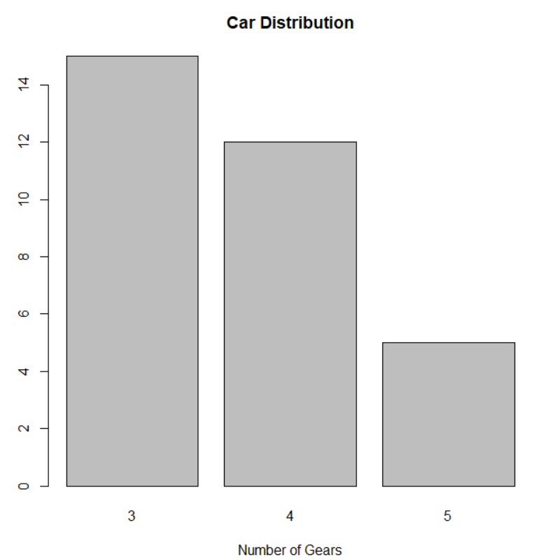
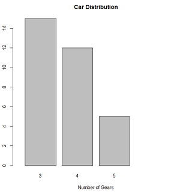
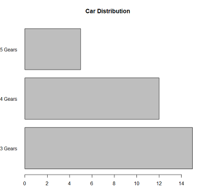
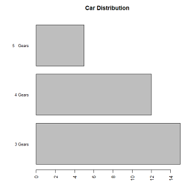

# barplot的各种不同形式
> 参考 Quick-R: http://www.statmethods.net/graphs/bar.html

## 简单情况

### 基本图形
```
counts <- table(mtcars$gear)
barplot(counts, main="Car Distribution", xlab="Number of Gears")
```

  

然而，图中bar太宽，需要调窄一点，这需要配合参数`xlim`

```
barplot(counts, main="Car Distribution", xlab="Number of Gears",
        xlim= c(0, 5)
        )
```



bar图水平放置，需要设置`horiz= TRUE`，另外配合使用参数`las`改变每个bar标签的方向

```
barplot(counts, main="Car Distribution", horiz=TRUE, las= 1,
        names.arg=c("3 Gears", "4 Gears", "5 Gears"))
```


默认情况下，barplot并不会画bar的分类坐标，我们可以使用`axis.lty= 1`显示出来；另外，控制标签的大小使用`cex.names`参数，我们还可以用`par`控制画布的位置

```
par(las=2) # make label text perpendicular to axis
par(mar=c(5,8,4,2)) # increase y-axis margin.
counts <- table(mtcars$gear)
barplot(counts, main="Car Distribution", horiz=TRUE, names.arg=c("3 Gears", "4 Gears", "5   Gears"), cex.names=0.8)
```




